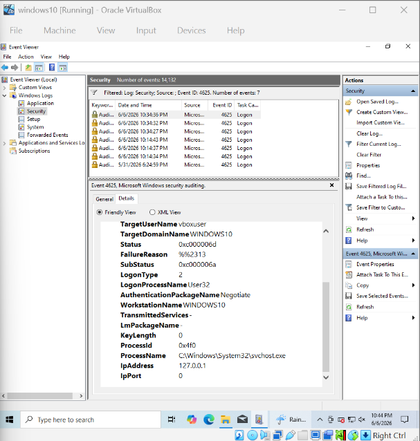

# Brute Force Detection

## Objective

Detect repeated failed authentication attempts that may indicate brute-force activity against the Windows VM.

## Data Source

Windows Security Event Logs.

## Attack Simulation

Multiple incorrect login attempts were intentionally generated against the Windows VM to produce Windows Security Event ID 4625 events.

## Event ID

4625 — Failed Logon

## MITRE ATT&CK

T1110 — Brute Force

## Detection Logic

The detection searches Windows Security logs for Event ID 4625, which represents a failed logon attempt. Multiple failed attempts associated with the same account or source IP within a short period can indicate possible brute-force activity.

## Splunk Query

[ actual working query goes here.]

## Evidence

## Investigation

[Explain what an analyst would investigate if the detection triggered.]
