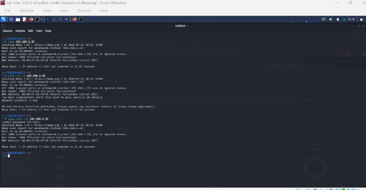
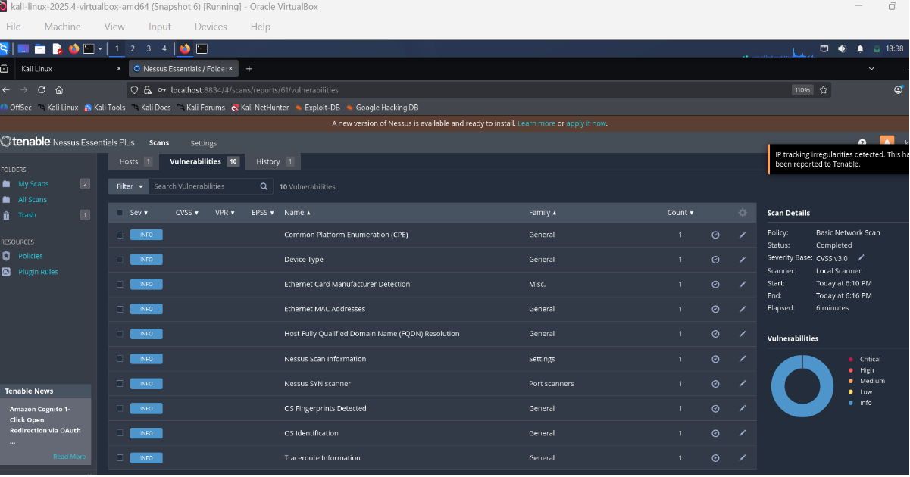
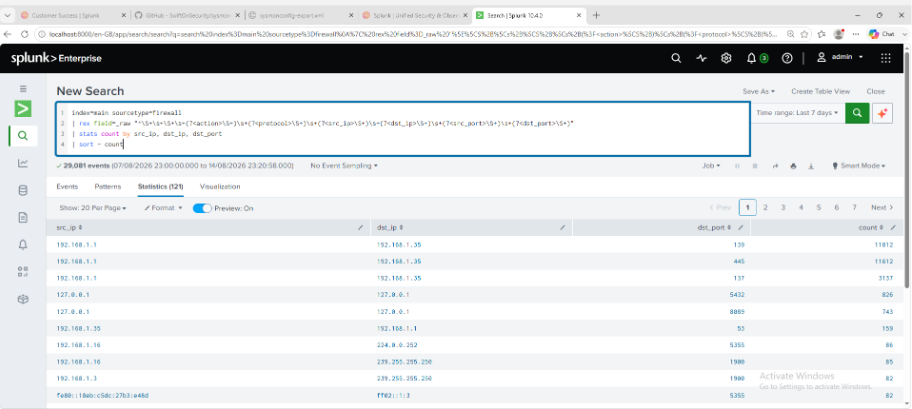

# Port Scan Detection

## Objective

Detect potential network/port scanning activity.

## Attack Simulation

Nmap was executed from Kali Linux against the Windows VM.

## Network Evidence

Wireshark was used to observe SYN traffic generated during scanning.

## MITRE ATT&CK

T1046 — Network Service Scanning

## Detection Logic

[Explain detection.]

## Splunk Query

[Actual working query.]

## Evidence

## Investigation

[What would an analyst investigate?]
