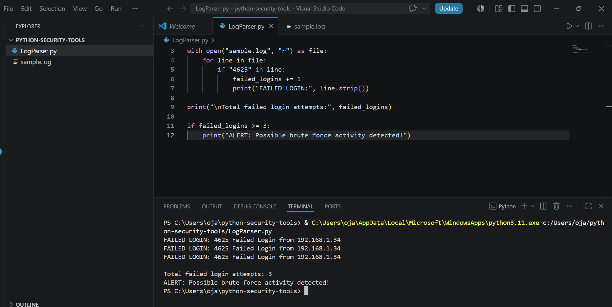

# Python Security Tools

A collection of beginner cybersecurity tools written in Python.

## Log Parser

A simple Python script that reads a log file and identifies failed
Windows login events using Event ID 4625. Also flags potential brute force if number of failed login attempts is 3 or more. 

## What It Does

- Reads a log file
- Searches for Event ID 4625
- Identifies failed login attempts
- Counts the number of failed logins

## Example

Input:

4625 Failed Login from 192.168.1.34

Output:

FAILED LOGIN: 4625 Failed Login from 192.168.1.34

